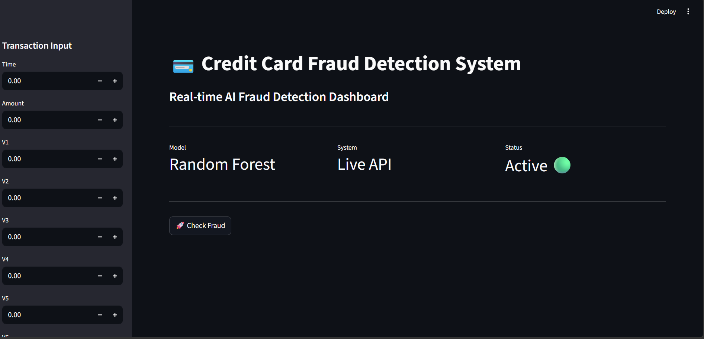
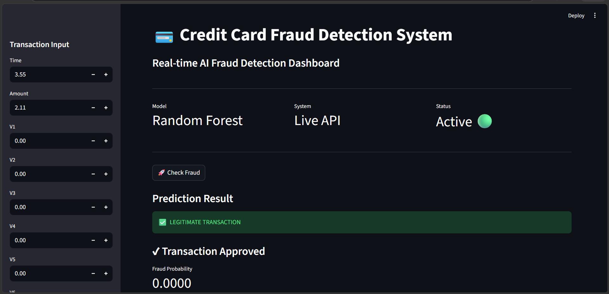
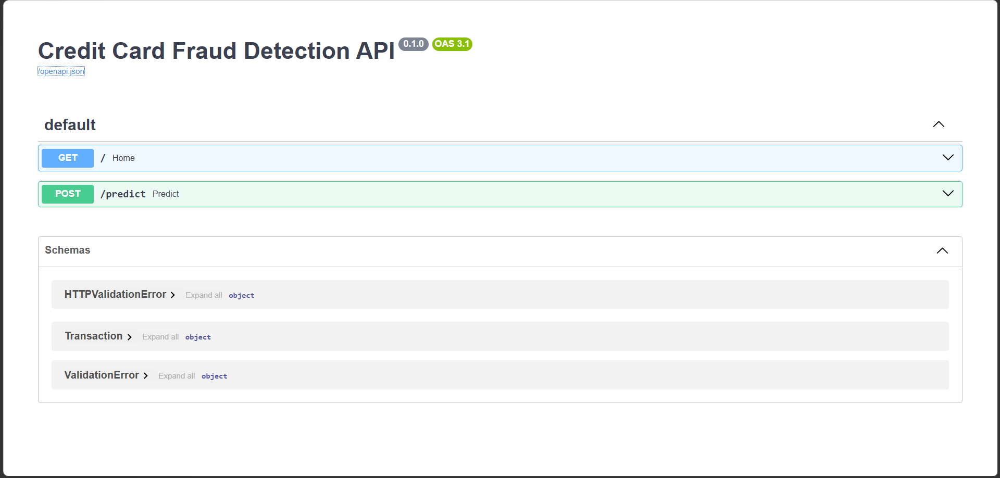

# 💳 Credit Card Fraud Detection System

## 🚀 Overview
An end-to-end Machine Learning system that detects fraudulent credit card transactions in real-time using a trained classification model. The system includes a FastAPI backend and a Streamlit dashboard for live predictions.

---

## 🎯 Problem Statement
Fraudulent transactions cause huge financial losses in banking systems. The goal is to detect fraud accurately while minimizing false alerts.

---

## 🧠 Solution
- Trained ML model on transaction data
- Handled class imbalance using SMOTE
- Built REST API using FastAPI
- Created interactive dashboard using Streamlit
- Enabled real-time fraud prediction

---

## 🏗️ Architecture
Streamlit UI → FastAPI → ML Model → Prediction → Result

---

## ⚙️ Tech Stack
- Python
- Scikit-learn
- Pandas, NumPy
- FastAPI
- Streamlit
- Imbalanced-learn

---

## 📊 Features
- Real-time fraud detection
- Probability scoring
- Interactive dashboard
- API-based architecture
- Model persistence

---

## 🚀 How to Run

### 1. Train Model
```bash
python src/train.py

### 2. Start API
python -m uvicorn api.app:app --reload

###3. Start UI
streamlit run streamlit_app.py

📸 Screenshots

## 📊 Dashboard UI


## ✅ Normal Transaction


## 📡 FastAPI Docs


👨‍💻 Author

Aarthi Kole